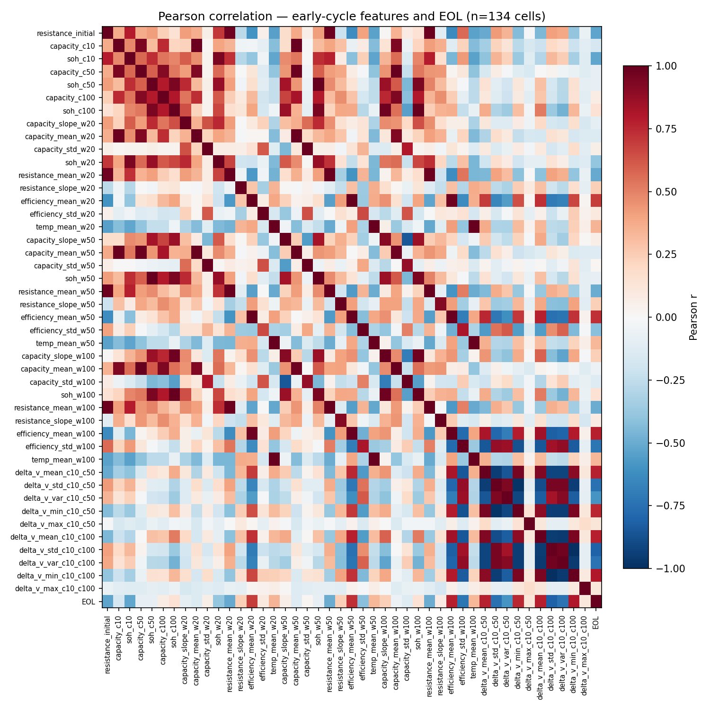

# 4. Feature Engineering

## 4.1 Overview

Week 3 builds a **cell-level feature matrix** for cycle-life prediction: one row per retained cell (134 after Week 2 dedupe), with hand-crafted measurements from the first 20, 50, and 100 cycles (`cycle_index ≥ 1`). Features follow Severson et al. (2019): per-cycle summary statistics plus **ΔV(Q)** voltage-curve differences from `cycles_interpolated`.

**Outputs:**

| File | Rows | Description |
|------|------|-------------|
| `data/processed/voltage_features.csv` | 134 | 10 ΔV(Q) features per cell |
| `data/processed/cell_features.csv` | 134 | Labels + **44** features (model input for Week 4) |

**Notebooks:** `04_extract_voltage_features.ipynb`, `05_build_cell_features.ipynb`, `06_feature_correlation.ipynb`. Index: `docs/week03/README.md`.

## 4.2 Summary features (`cycle_summary.csv`)

Extracted in `05_build_cell_features.ipynb` from the 16-field per-cycle table (110,910 rows). **34 features** per cell:

| Group | Count | Examples |
|-------|-------|----------|
| Resistance | 7 | `resistance_initial`; mean and linear slope over w20 / w50 / w100 |
| Capacity snapshots | 6 | `capacity_c10`, `soh_c10`, … at cycles 10, 50, 100 |
| Capacity windows | 9 | slope, mean, std of discharge capacity over w20 / w50 / w100 |
| State of health | 3 | `soh_w20`, `soh_w50`, `soh_w100` (capacity at window end ÷ `initial_capacity`) |
| Energy efficiency | 6 | mean and std of `energy_efficiency` over w20 / w50 / w100 (dataset field; not Coulombic/Ah ratio) |
| Temperature | 3 | mean `temperature_average` over w20 / w50 / w100 |

**Window notation:** `w20`, `w50`, `w100` denote statistics over cycles **1–20**, **1–50**, and **1–100** respectively. Linear slopes use ordinary least-squares fit vs `cycle_index`. SOH uses each cell’s `initial_capacity` from `cell_targets.csv`.

## 4.3 Voltage ΔV(Q) features (raw JSON)

Following Severson et al., `04_extract_voltage_features.ipynb` reads `cycles_interpolated` from each kept JSON file and computes discharge **ΔV(Q) = V_late(Q) − V_early(Q)** on the overlapping capacity range, interpolated to a common grid. Statistics per pair: mean, std, variance, min, max.

| Cycle pair | Features (5 stats each) |
|------------|-------------------------|
| 10 → 50 | `delta_v_*_c10_c50` |
| 10 → 100 | `delta_v_*_c10_c100` |

**10 voltage features** total. Pairs align with the 50- and 100-cycle early windows used in summary features and planned ablations (Week 7).

## 4.4 Feature matrix

`cell_features.csv` merges:

- **Labels:** `file_id`, `cell_id`, `EOL`, `initial_capacity`
- **34** summary features (§4.2)
- **10** ΔV(Q) features (§4.3)

All 134 cells have complete feature rows (no missing values in the current cleaned dataset). Keys are unique on `file_id` (one test file per row).

## 4.5 Exploratory correlation with EOL

Before training models, `06_feature_correlation.ipynb` computes **Pearson correlation** between each feature and EOL across all 134 cells, and saves a feature–feature heatmap including EOL.

**Strongest univariate associations (|r| ≈ 0.7–0.8):**

| Feature | Pearson *r* | Interpretation |
|---------|-----------|----------------|
| `delta_v_std_c10_c100` | −0.81 | Greater spread in voltage-curve change (cycles 10→100) associates with **shorter** life |
| `delta_v_min_c10_c100` | +0.80 | Higher minimum ΔV associates with **longer** life |
| `efficiency_mean_w100` | +0.78 | Higher mean energy efficiency (cycles 1–100) associates with **longer** life |

**Weaker linear links:** capacity snapshots and capacity slopes alone (e.g. `capacity_c100`, |*r*| ≈ 0.07). This matches Severson et al.: **voltage-curve geometry and efficiency shift before obvious capacity fade** in the first ~100 cycles.

The heatmap also shows **high redundancy** among related features (blocks of correlated ΔV statistics and overlapping window summaries). This is expected and motivates **regularization or feature selection** in Week 4 (e.g. ElasticNet) rather than treating all 44 columns as independent inputs.

These correlations are **exploratory** (full dataset, univariate); predictive performance and feature importance will be assessed with held-out cells in §6.

## 4.6 Summary

We constructed 44 interpretable early-cycle features per cell—capacity, resistance, energy efficiency, temperature summaries over three windows, plus Severson-style ΔV(Q) curve differences. Univariate screening indicates ΔV(Q) and energy efficiency as the strongest linear signals for EOL on this dataset; raw capacity fade is a weaker solo predictor. The matrix `cell_features.csv` is the input for classical ML baselines in Week 4.
