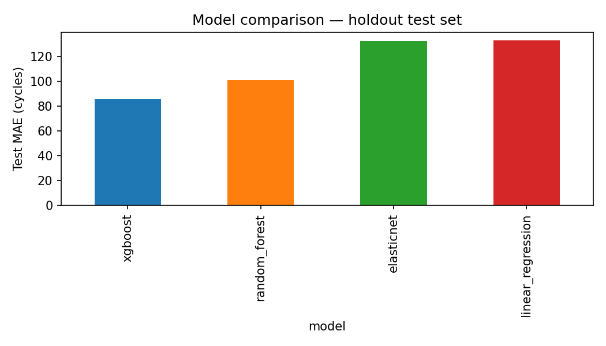
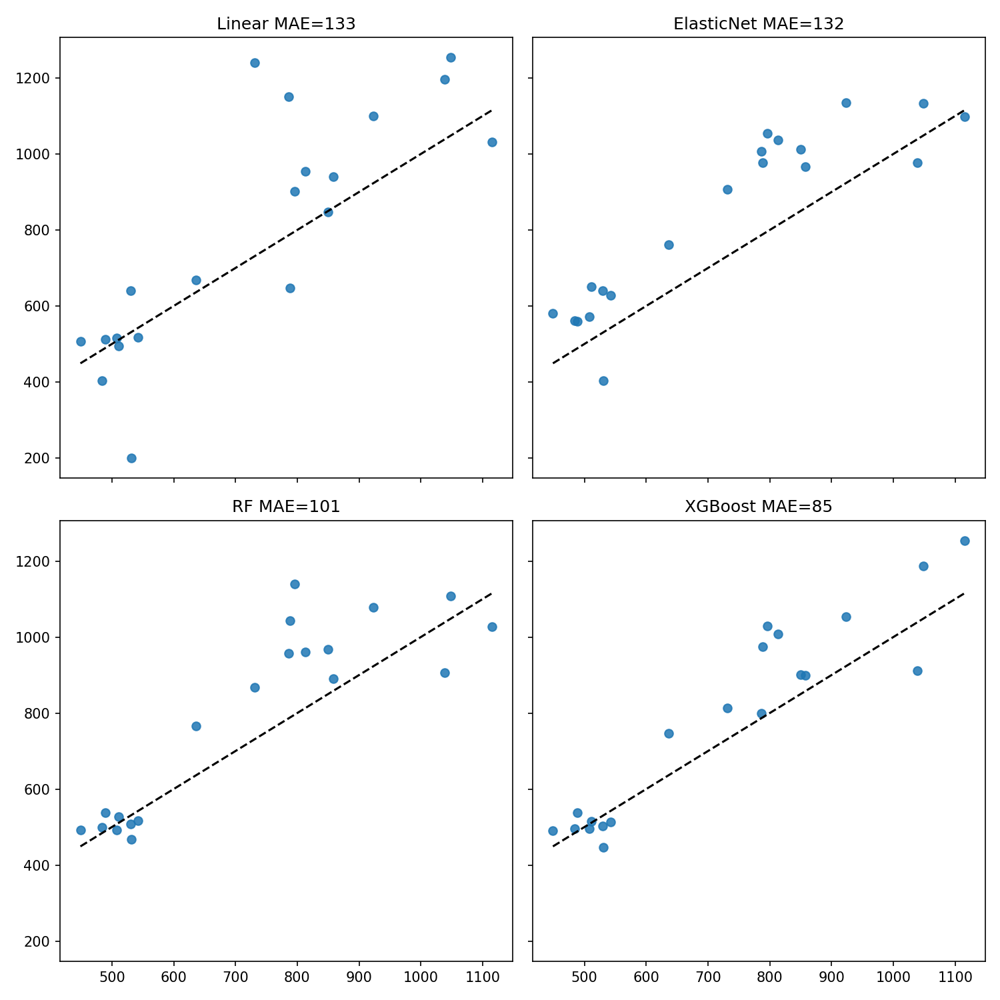
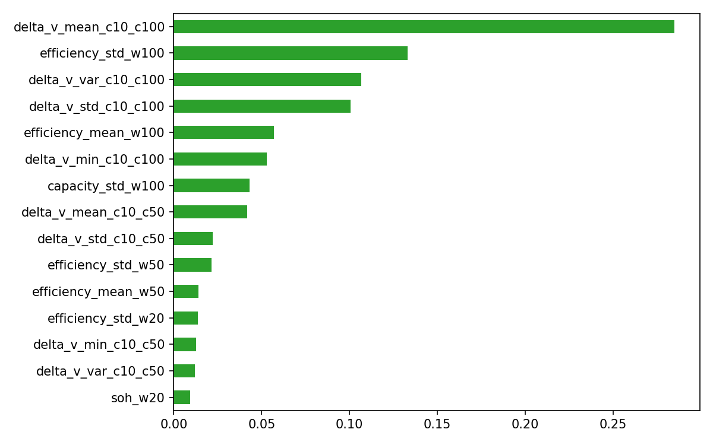
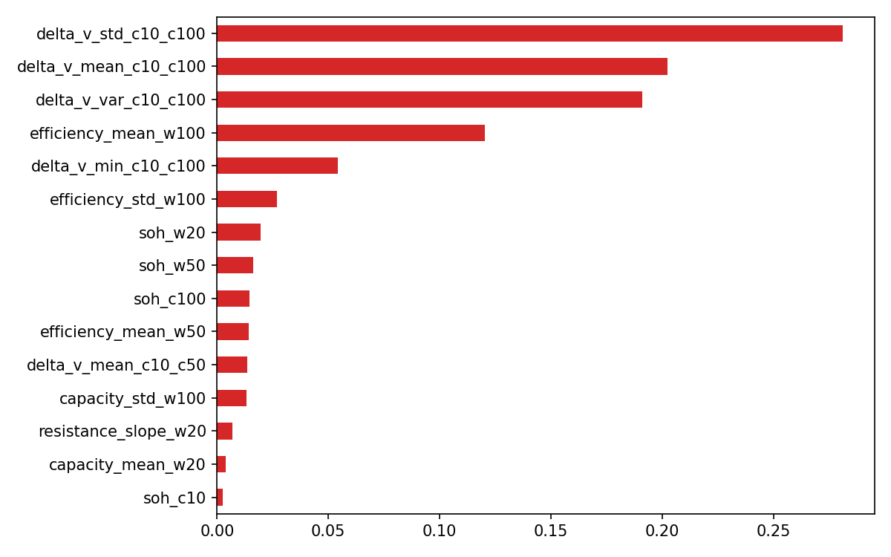
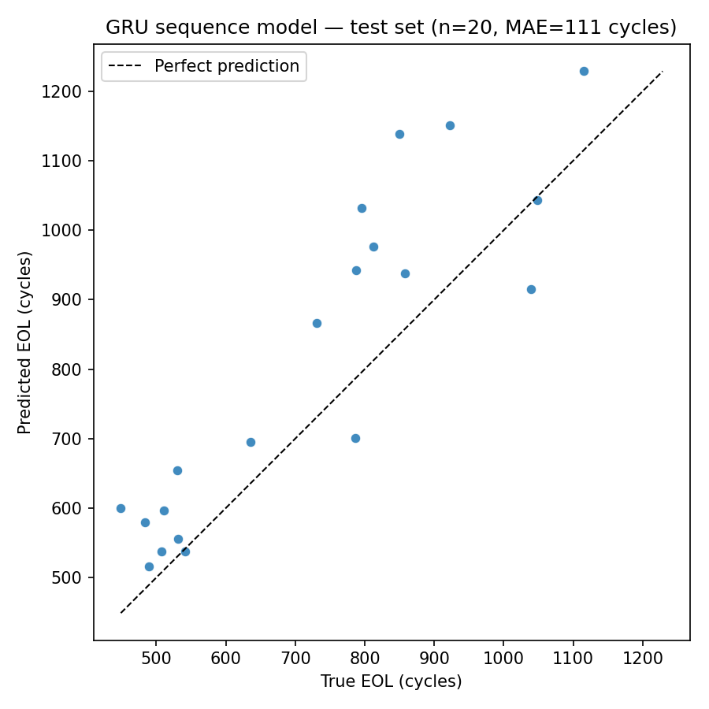
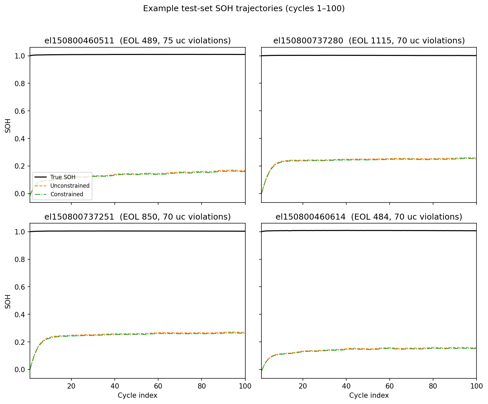
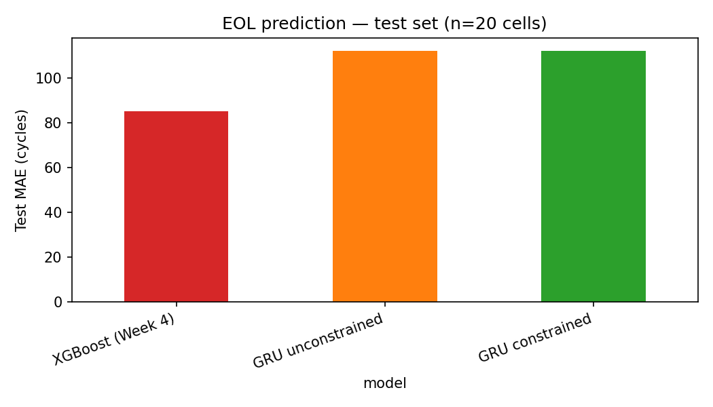

# 6. Results

## 6.1 Machine learning baselines

We trained four regressors on `cell_features.csv` with the cell-level split in §5.1. Table 1 summarizes **holdout test** performance (*n* = 20 cells).

**Table 1 — Test-set EOL prediction error**

| Model | MAE (cycles) | RMSE (cycles) | MAPE (%) |
|-------|-------------|---------------|----------|
| Linear regression | 133 | 186 | 18.4 |
| ElasticNet | 132 | 147 | 19.3 |
| Random forest | 101 | 132 | 13.3 |
| **XGBoost** | **85** | **108** | **11.0** |

**Best validation hyperparameters:** ElasticNet `alpha ≈ 40`, `l1_ratio = 1.0`; random forest `max_depth = 5`, `min_samples_leaf = 1`; XGBoost `max_depth = 5`, `learning_rate = 0.1`.

### Interpretation

**Tree ensembles outperform linear models on holdout.** XGBoost achieves the lowest test MAE (about 85 cycles, about 11% MAPE), followed by random forest (about 101 cycles). Plain linear regression and ElasticNet both score about 132 cycles MAE on test despite ElasticNet improving validation error substantially (validation MAE about 70 vs about 280 for linear). That gap suggests high variance across small val/test folds rather than a stable ordering; with only 20 test cells, metrics should be interpreted cautiously.

**Linear models overfit the training set.** Training MAE for linear regression (about 85 cycles) is much lower than test (about 133), while ElasticNet’s penalty raises training error (about 125) and improves validation behavior. This matches the Week 3 correlation heatmap: many redundant features motivate regularization or nonlinear models.

**Feature importance aligns with exploratory correlation.** Random forest and XGBoost rank **ΔV(Q)** statistics (e.g. `delta_v_mean_c10_c100`, `delta_v_var_c10_c100`) and **energy efficiency** summaries (`efficiency_std_w100`, `efficiency_mean_w100`) among the strongest predictors—consistent with §4.5 and Severson et al. (2019), where voltage-curve geometry and efficiency shift before obvious capacity fade.

### Limitations

- **Small holdout** (*n* = 20 test, *n* = 20 val) yields noisy metrics; a single mis-predicted short-life cell can inflate MAPE.
- **XGBoost fits training data nearly exactly** (train MAE ≈ 0), indicating memorization; test performance is still best among baselines but future work should monitor overfitting (e.g. stronger regularization, fewer trees).
- **No early-cycle window ablation yet** — all 44 features use up to 100 cycles; Week 7 varies *N* = 20, 50, 100.

XGBoost is the **Week 4 reference baseline** for Week 5 sequence-model comparison.

## 6.2 Sequence model

We trained the GRU sequence model in §5.2 on early per-cycle trajectories (100 cycles × 4 channels). Table 2 compares **holdout test** performance to the Week 4 XGBoost baseline (*n* = 20 test cells).

**Table 2 — Test-set EOL prediction error (sequence vs best tabular baseline)**

| Model | MAE (cycles) | RMSE (cycles) | MAPE (%) |
|-------|-------------|---------------|----------|
| **XGBoost (Week 4)** | **85** | **108** | **11.0** |
| GRU sequence (Week 5) | 111 | 134 | 15.4 |

**Best validation hyperparameters (GRU):** hidden size 64, 2 layers, dropout 0.2, learning rate 0.0003.

**Full split metrics (GRU):** train MAE 166, RMSE 255, MAPE 18.6%; val MAE 100, RMSE 129, MAPE 19.8%.

### Interpretation

**XGBoost remains the stronger holdout model.** The tuned GRU achieves test MAE about 111 cycles (about 15% MAPE) versus about 85 cycles (about 11% MAPE) for XGBoost—a gap of roughly 25 cycles on average. Validation MAE (about 100) is slightly better than test, suggesting modest fold variance rather than catastrophic overfitting, though train MAE (166) indicates the recurrent model does not fit the training set as tightly as XGBoost (train MAE ≈ 0).

**Why the sequence model may lag.** (1) Only **94** training cells for a neural sequence model with about 100 timesteps each. (2) Input channels exclude **ΔV(Q)** and other hand-crafted summaries that ranked highest in Week 4 feature importance. (3) Capacity and resistance change slowly in the first 100 cycles (SOH at cycle 100 still near 1.0 for many cells); much of the predictive signal in tabular models came from efficiency and voltage-curve statistics aggregated over the window.

**Target scaling was required for training.** Initial experiments without EOL standardization produced validation MAE >600 cycles (worse than predicting the train mean). Scaling the regression target during optimization improved validation MAE to about 100 cycles; this is noted as an implementation detail for small-data neural regression.

### Limitations

- Same small holdout as §6.1 (*n* = 20 test).
- **Feature mismatch vs XGBoost** — not a controlled architecture-only ablation.
- Single sequence length (*N* = 100); Week 7 ablations will vary the early window.
- No model checkpoint committed; metrics reproduced from `notebooks/08_sequence_model.ipynb` and `results/metrics/gru_sequence.json`.

The GRU is retained as the **Week 5 sequence baseline** for Week 6 (monotonic SOH constraint) and Week 7 comparisons.

## 6.3 Physics-informed constraint

We trained the dual-head GRU in §5.3 in **unconstrained** (λ = 0) and **constrained** (best λ from grid) modes. Table 3 summarizes **holdout test** EOL error (*n* = 20 cells); Table 4 reports SOH monotonic violations on the same split.

**Table 3 — Test-set EOL prediction error (monotonic constraint vs baselines)**

| Model | MAE (cycles) | RMSE (cycles) | MAPE (%) |
|-------|-------------|---------------|----------|
| **XGBoost (Week 4)** | **85** | **108** | **11.0** |
| GRU dual-head, unconstrained | 112 | 134 | 15.9 |
| GRU dual-head, constrained (λ = 1.0) | 112 | 134 | 15.9 |

**Best λ (validation EOL MAE):** 1.0 (grid {0.01, 0.1, 1.0}; validation MAE about 99.5 cycles for all three λ values within rounding).

**Table 4 — SOH monotonic violations (test set)**

| Model | Violations | Violation rate (%) |
|-------|-----------|-------------------|
| Unconstrained | 1,199 | 60.6 |
| Constrained (λ = 1.0) | 1,191 | 60.2 |

### Interpretation

**EOL error is essentially unchanged by the monotonic penalty.** Unconstrained and constrained dual-head models both achieve test MAE about 112 cycles—within rounding of the Week 5 single-head GRU (about 111 cycles). Training and early stopping prioritize EOL; the SOH reconstruction term and monotonic penalty act on a separate output head whose gradients weakly affect the shared GRU representation.

**The penalty slightly reduces SOH violations but not dramatically.** Test violation rate falls from about 60.6% to about 60.2% of consecutive cycle pairs at λ = 1.0—a drop of about 0.4 percentage points. Many violations correspond to small upward wiggles on an otherwise flat predicted curve in the first 100 cycles, where true SOH remains near 1.0; the tested λ values are too small to enforce visibly smoother trajectories without a larger trade-off against EOL or SOH reconstruction loss.

**XGBoost remains the strongest holdout model.** The monotonic constraint does not add input features (ΔV(Q) and other Week 3 summaries are still absent from the sequence). Closing the about 25-cycle gap to XGBoost would require richer inputs or a different modeling approach, not SOH regularization alone.

### Limitations

- Same small holdout as §6.1–§6.2 (*n* = 20 test).
- λ grid limited to {0.01, 0.1, 1.0}; stronger penalties or post-hoc monotonic projection were not explored.
- EOL is predicted from the final hidden state, not derived from the SOH curve crossing 80%—the two outputs are only loosely coupled.
- Metrics reproduced from `notebooks/09_monotonic_soh.ipynb`, `gru_unconstrained.json`, and `gru_monotonic.json`.

## 6.4 Ablation: early-cycle windows *(Week 7)*

*(To be completed — compare N = 20, 50, 100 cycles.)*
