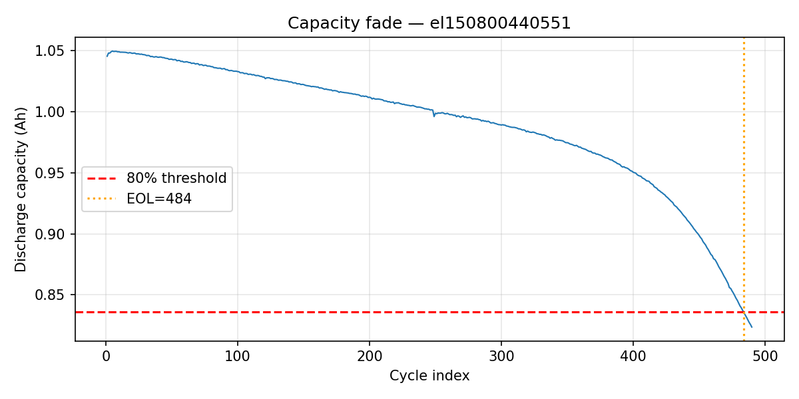
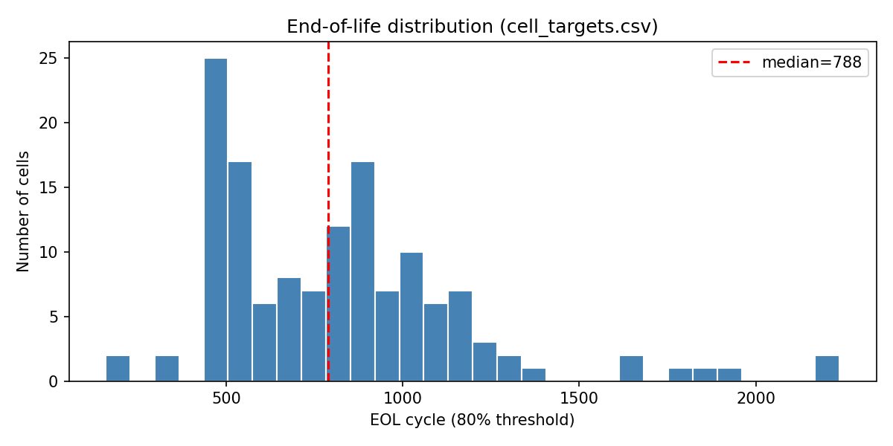
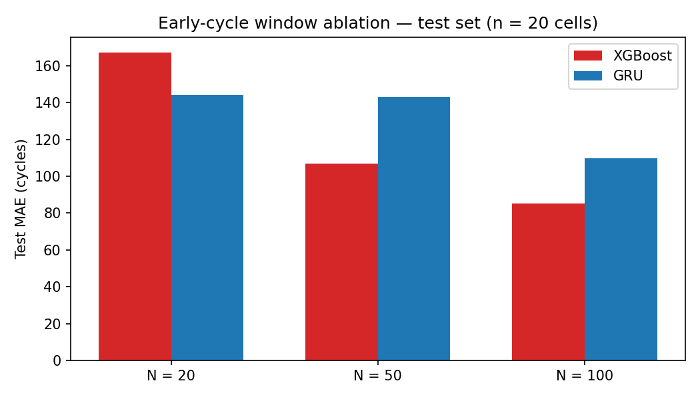

# Problem & motivation

- Lithium-ion cells lose capacity over cycling; full life tests can run **hundreds to thousands of cycles**
- **Goal:** predict **end-of-life (EOL)** from **early-cycle** measurements before obvious fade
- **EOL:** first cycle where discharge capacity &lt; **80%** of initial capacity (`cycle_index ≥ 1`)
- **Dataset:** MIT-Stanford-Toyota fast-charging cohort (Severson et al., 2019)
- **Approach:** reproducible pipeline → tabular ML vs GRU → monotonic SOH check → window ablation

# Dataset & pipeline

- **Raw:** 140 JSON files → **134 unique cells** (dedupe policy; one partial cell dropped)
- **Tables:** about 111k cycle rows · 44 cell-level features · **94 / 20 / 20** split (`random_state = 42`)
- **Pipeline:** notebooks `01`–`10` · `data/processed/` · `results/metrics/` · `results/figures/`

# Capacity fade & EOL distribution

- Example cell with 80% threshold; **134** cells · median EOL about **792** cycles · range **159–2,237**
{width=48%} {width=48%}

# Early-cycle features

- **44 features:** capacity, SOH, resistance, energy efficiency, temperature + **ΔV(Q)** (cycles 10→50, 10→100)
- Strongest correlates: **ΔV(Q) spread** (|r| about 0.8) · **energy efficiency** (r about 0.78)

# ML baselines — test error (20 cells)

| Model | MAE | MAPE |
|-------|-----|------|
| Linear | 133 | 18% |
| RF | 101 | 13% |
| **XGBoost** | **85** | **11%** |

# ML — predicted vs true EOL

- **XGBoost best** — about **85 cycles** MAE; ΔV(Q) and efficiency drive importance · **20 test cells**

# GRU sequence model

- **100 cycles × 4 channels** (SOH, resistance, efficiency, temperature) · **Test MAE about 110 cycles** (behind XGBoost)

# Monotonic SOH constraint

- Dual-head GRU + monotonic penalty · **EOL MAE about 112 cycles** (constrained ≈ unconstrained)

# Early-cycle ablation

| N | XGBoost | GRU |
|---|---------|-----|
| 20 | 167 | 144 |
| 50 | 107 | 143 |
| 100 | **85** | 110 |

# Limitations

- **134 cells**, **20-cell** test holdout · single LFP fast-charge protocol
- XGBoost uses ΔV(Q); GRU uses four summary channels only
- Mechanism-agnostic features; fixed 80% EOL definition

# Conclusions & future work

- **Best:** XGBoost at *N* = 100 — about **85 cycles** test MAE
- **Screening:** about **50–100 cycles** + voltage-curve features
- **Future:** NASA/CALCE validation · ΔV(Q) in sequences · larger cohorts
- github.com/levonl22/gnem-battery-degradation
